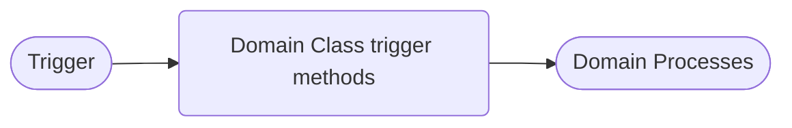
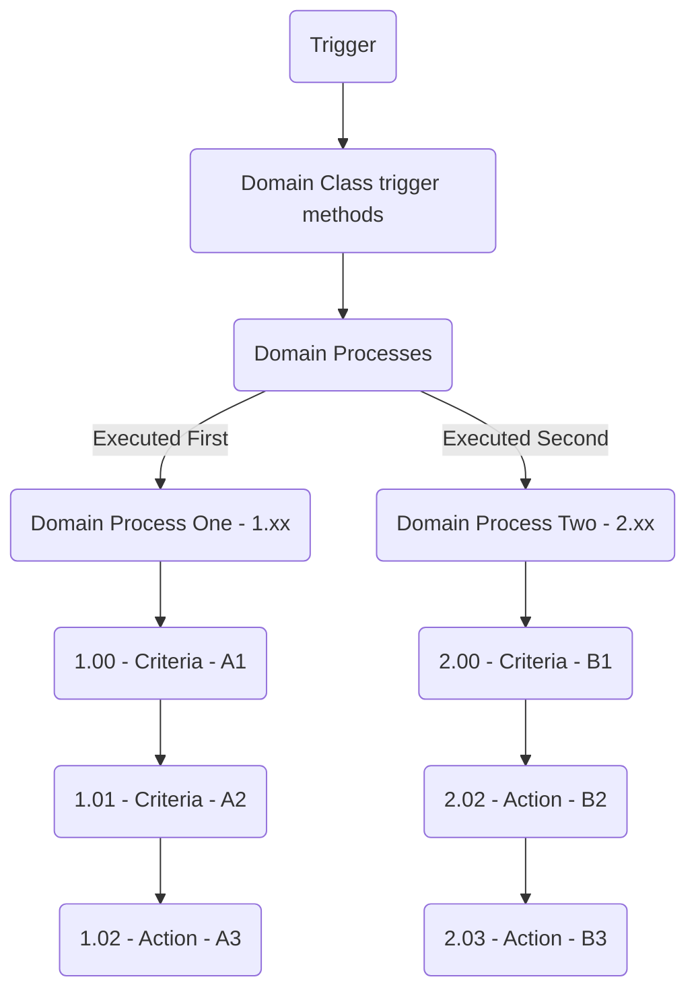

# Domains

What are domain classes... TBD

## Domain Processes

Domain Processes are an ordered series of classes that filter and mutate SObjects for a defined business process.

### How are Domain Processes used?

Domain Processes are used via SObject trigger transactions or manually called from Apex classes.

### How are Domain Processes defined?

Domain processes are defined via the `Domain Process Binding` custom metadata type.
- Label
- Domain Process Binding Name (i.e. Case_IsUrgentCriteria)
- Is Active?
- Order of Execution (Float number - i.e. 1.01 or 10.01)
- Process Context
    - Trigger Execution
    - Domain Process Execution
- Related Domain SObject Binding
- Related Domain SObject Binding Alternate
  - Used when the SObject isn't available in the `Related Domain SObject Binding` list.  i.e. ContentDocumentLink
- Domain Method Token
  - Unique identifier for a group domain processes.
  Only used when calling domain processes from Apex.
- Trigger Operation
  - Only used when the Process Context is Trigger Execution
  - Options:
    - Before Insert
    - After Insert
    - Before Update
    - After Update
    - Before Delete
    - After Delete
    - After Undelete
- Class To Inject
  - Name of the `criteria` or `action` class
- Order Of Execution (Float i.e. 1.xx, 10.xx)
  - The number to the left of the decimal is the order of execution for domain processes.
        Example: There are two teams that both work on the Case object.
        Team one will put their domain process bindings as `1.xx`.
        Team two will put their domain process bindings as `2.xx`.
        When the domain process is called, the each group will be called in numerical order
        according to this number.
    - Team One `1.xx` domain process --> Executed first
    - Team Two `2.xx` domain process --> Executed second
  - The number to the right of the decimal is the order of execution within a single domain process.
    The `criteria` and `action` classes within the domain process will be called in numerical order
    according to this number.
    - CriteriaOne will be `1.00` --> Executed first
    - CriteriaTwo will be `1.01` --> Executed second
    - ActionOne will be `1.02` --> Executed third
- Prevent Recursive
  - Applicable to Trigger Execution only
  - Prevents `action` classes from being called more than once.
- Logical Inverse
  - Changes a `criteria` class from returning matching records to filtering out the matching records.
- Description
- Execute Asynchronous
  - Runs the domain process in a Queueable and not in the primary execution thread.

### Can `Criteria` and `Action` classes be reused in different Domain Processes?

Yes.

Each domain process will be treated in isolation. If the criteria classes from domain process 1 criteria filter the active record set down to a subset for the domain process 1 actions, it will only be for those actions. When domain process 2 begins, it will start fresh with the original set of records and the domain process 2 criteria will filter that original record set down to a subset that the domain process 2 actions will work on. The same is true for when domain process 3 begins. Each domain process begins with the same original group of records. This is true regardless of whether or not the same physical crtiera or action class is utililzed in multiple domain processes.

Also note that these domain process ids are specific to the other defining traits of the domain process. What I mean is a domain process is classified by multiple elements:

the SObject involved,
Trigger or Domain Method context,
If Domain Method context, then what is the unique "domain method token",
If Trigger context, then what type of Trigger context -- Before Insert, After Update, etc.
So, you could see a domain process id of "1" for all of the following combination examples:

Account - Trigger context - BeforeInsert
Account - Trigger context - AfterUpdate
Contact - Trigger context - BeforeInsert
Account - Domain Method context - unique "domain method token"
Contact - Domain Method context - unique "domain method token"
etc...

#### Triggers

Order of Operations





#### From an Apex Class

Domain process token only

```apex
casesDomain
    .getDomainProcessCoordinator()
    .processDomainLogicInjections('Domain Process One');

```

Domain process token and unit of work
```apex
casesDomain
    .getDomainProcessCoordinator()
    .processdomainLogicInjections(
        'Domain Process One',
        unitOfWork
    );
```

Domain process token and a list of existing records
```apex
casesDomain
    .getDomainProcessCoordinator()
    .processdomainLogicInjections(
        'Domain Process One',
        existingCaseRecords
    );
```


Domain process token, list of existing records, and unit of work
```apex
casesDomain
    .getDomainProcessCoordinator()
    .processdomainLogicInjections(
        'Domain Process One',
        existingCaseRecords,
        unitOfWork
    );
```


### Domain Process Criteria

Class that filters records to be processed by a `Domain Process Action` class.

```apex
public class AccountNameContainsFishCriteria
        implements IDomainProcessCriteria
{
  private list<Account> records = new list<Account>();

  public IDomainProcessCriteria setRecordsToEvaluate(List<SObject> records)
  {
    this.records.clear();
    this.records.addAll( (list<Account>)records );

    return this;
  }

  public List<SObject> run()
  {
    list<Account> qualifiedRecords = new list<Account>();

    // Loop through the Account records.
    for ( Account record : this.records )
    {
      // We are only interested in Account records that have the word fish in their name
      if ( record.Name.containsIgnoreCase('fish') )
      {
        qualifiedRecords.add( record );
      }
    }

    return qualifiedRecords;
  }
}
```

### Domain Process Action

Class that mutates an SObject.

```apex
public class DefaultAccountSloganBasedOnNameAction
        extends DomainProcessAbstractAction
{
  public override void runInProcess()
  {
    Account accountRecord = null;

    for ( SObject record : this.records )
    {
      accountRecord = (Account)record;
      accountRecord.Slogan__c = accountRecord.name + ' is a fishy business';
    }
  }
}
```